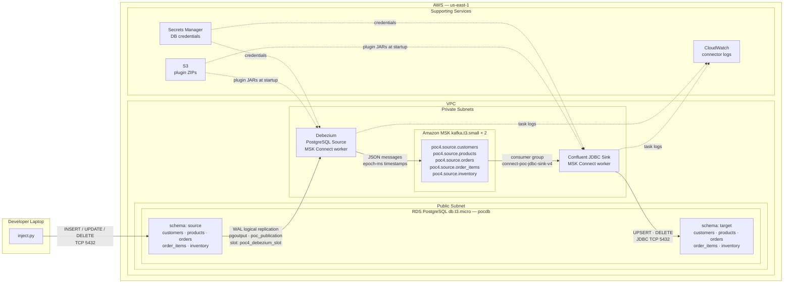

# DataStream POC — Architecture & Component Reference

End-to-end CDC pipeline: changes made to the `source` schema in a single RDS PostgreSQL instance are captured by Debezium, published to Amazon MSK (Kafka), consumed by a Confluent JDBC Sink connector, and written to the `target` schema in the same RDS instance — typically within 5–15 seconds.

## Architecture Diagram



```
Developer laptop
  └─ inject.py ──────────────────────────────────────────────┐
                                                              │ TCP 5432
AWS VPC                                                       │
┌─────────────────────────────────────────────────────────── ▼ ──────────┐
│                                                                         │
│  RDS PostgreSQL db.t3.micro  (public subnet, publicly accessible)       │
│  ├── schema: source  ← inject.py writes here                            │
│  └── schema: target  ← JDBC Sink writes here                            │
│          │                                                               │
│          │ WAL logical replication (pgoutput)                            │
│          ▼                                                               │
│  Debezium MSK Connect Connector  (private subnet)                        │
│          │                                                               │
│          │ JSON messages — poc4.source.<table>                           │
│          ▼                                                               │
│  Amazon MSK  kafka.t3.small × 2 brokers  (private subnet)               │
│          │                                                               │
│          │ consumer group: connect-poc-jdbc-sink-v4                      │
│          ▼                                                               │
│  Confluent JDBC Sink MSK Connect Connector  (private subnet)             │
│          │                                                               │
│          │ UPSERT / DELETE via JDBC                                      │
│          ▼                                                               │
│  RDS PostgreSQL → schema: target                                         │
│                                                                         │
│  S3 Bucket  — connector plugin ZIPs                                     │
│  Secrets Manager  — DB credentials                                      │
│  CloudWatch  — connector + broker logs                                  │
└─────────────────────────────────────────────────────────────────────────┘
```

---

## 1. VPC (`lib/vpc-stack.ts`)

Creates the network layer that all other resources live in.

**Subnets**
- **Public subnets (2 AZs):** RDS instance lives here. `publicly_accessible=true` allows direct psql/inject.py connections from a developer laptop.
- **Private subnets (2 AZs):** MSK brokers and MSK Connect workers live here. No direct internet access; they reach RDS and S3 via a single NAT gateway.

**Security groups**

| Group | Allows inbound | Purpose |
|---|---|---|
| `sg-rds` | Port 5432 from developer IP + `sg-msk-connect` | RDS access from laptop and connectors |
| `sg-msk` | Port 9092 from `sg-msk-connect` | Kafka PLAINTEXT from Connect workers only |
| `sg-msk-connect` | All outbound | Connect workers reach MSK and RDS |

The developer IP is passed at deploy time via `--context devIp=<ip>/32`. Without it, port 5432 is open to all IPv4 (POC only — never do this in production).

---

## 2. RDS PostgreSQL (`lib/rds-stack.ts`)

A single `db.t3.micro` instance running PostgreSQL 15. Both `source` and `target` schemas live in the same database (`pocdb`), halving cost compared to two instances.

**Instance settings**
- Single-AZ, no Multi-AZ, no RDS Proxy, no read replicas
- 20 GB gp3 storage
- Deletion protection OFF (so `cdk destroy --all` works without manual intervention)

**Custom parameter group** — three parameters are required for Debezium's logical replication:

| Parameter | Value | Why |
|---|---|---|
| `rds.logical_replication` | `1` | Enables WAL logical replication (the mechanism Debezium reads) |
| `max_replication_slots` | `5` | One slot per Debezium connector; keep headroom |
| `max_wal_senders` | `5` | One WAL sender process per replication slot |
| `wal_sender_timeout` | `0` | Prevents RDS from killing idle replication connections |

**Credentials** are auto-generated and stored in Secrets Manager as `datastream-poc-db-secret`. inject.py and the connector shell scripts read from Secrets Manager — no plaintext passwords anywhere.

**Outputs**
- `DbEndpoint` → used as `DB_HOST` environment variable for inject.py
- `DbSecretArn` → used as `DB_SECRET_ARN` environment variable

---

## 3. Database Schema (`sql/schema.sql`, `inject.py init`)

Two schemas inside `pocdb`:

**`source` schema** — Debezium watches this. inject.py writes to this.

```
customers    id, name, email, status, created_at TIMESTAMP(3), updated_at TIMESTAMP(3)
products     id, name, category, price, stock_qty, updated_at TIMESTAMP(3)
orders       id, customer_id, status, total_amount, order_date TIMESTAMP(3), updated_at TIMESTAMP(3)
order_items  id, order_id, product_id, quantity, unit_price
inventory    id, product_id, warehouse_id, quantity, last_updated TIMESTAMP(3)
```

**`target` schema** — JDBC Sink writes to this.

Same column names and types as source, with two differences:
- Timestamp columns are `BIGINT` (stores epoch-milliseconds) — required by how the JDBC Sink handles Debezium's timestamp encoding (see §6)
- No foreign key constraints — the sink does simple upserts and doesn't need referential integrity

**Debezium publication** (`poc_publication`) — declares which tables go into the WAL stream. Created once:
```sql
CREATE PUBLICATION poc_publication
  FOR TABLE source.customers, source.products, source.orders,
            source.order_items, source.inventory;
```

---

## 4. Amazon MSK (`lib/msk-stack.ts`)

A provisioned Kafka cluster that acts as the message bus between Debezium and the JDBC Sink.

**Cluster configuration**
- `kafka.t3.small` × 2 brokers, placed in private subnets
- Kafka version 3.6.0
- PLAINTEXT transport (no TLS) — acceptable for a VPC-internal POC; simplifies connector config
- No client authentication (unauthenticated mode)

**Broker config (`CfnConfiguration`)**

| Setting | Value | Why |
|---|---|---|
| `auto.create.topics.enable` | `true` | Debezium creates `poc4.source.<table>` topics automatically on first publish |
| `default.replication.factor` | `2` | Both brokers hold a replica of each partition |
| `min.insync.replicas` | `1` | Allows writes when one broker is temporarily down |
| `log.retention.hours` | `168` | Topics retain 7 days of messages |
| `num.partitions` | `3` | Default partitions per topic — Debezium uses one partition for snapshot ordering |

**Topics created by Debezium** (one per source table):
```
poc4.source.customers
poc4.source.products
poc4.source.orders
poc4.source.order_items
poc4.source.inventory
```

The `poc4` prefix is the `topic.prefix` in the Debezium connector config. The prefix was bumped (poc → poc2 → poc3 → poc4) during debugging to force fresh topics and avoid stale messages from prior failed connector runs.

---

## 5. MSK Connect Infrastructure (`lib/connectors-stack.ts`)

Provides the IAM role, S3 bucket, and log group shared by both connectors.

**S3 bucket (`datastream-poc-plugins-<account>-<region>`)**
Stores the connector plugin ZIPs uploaded by `setup-connectors.sh`:
- `debezium-connector-postgresql.zip` — Debezium PostgreSQL source connector from Confluent Hub
- `kafka-connect-jdbc.zip` — Confluent JDBC Sink connector + PostgreSQL JDBC driver (added manually before re-zipping)

MSK Connect downloads these ZIPs when creating connectors; it cannot pull from the internet at connector creation time.

**IAM execution role (`datastream-poc-msk-connect-role`)**
Assumed by `kafkaconnect.amazonaws.com`. Grants:
- `s3:GetObject` on the plugin bucket — to download the connector JARs
- `secretsmanager:GetSecretValue` — to read DB credentials at runtime
- `logs:PutLogEvents` etc. — to write connector task logs to CloudWatch
- `kafka-cluster:*` actions — to connect to MSK, read/write topics, manage consumer groups
- `ec2:CreateNetworkInterface` etc. — MSK Connect needs to create ENIs in the VPC to reach MSK and RDS

**CloudWatch log group (`/datastream-poc/msk-connect`)**
Both connectors write task logs here. Each MSK Connect worker gets its own log stream named `<connector-name>-<uuid>-<worker-id>`.

---

## 6. Debezium Source Connector (`recreate-source-connector.sh`)

Reads PostgreSQL's write-ahead log (WAL) via logical replication and publishes row change events to MSK topics.

**How logical replication works**
PostgreSQL writes every committed change to the WAL. With `rds.logical_replication=1`, an external process (Debezium) can open a replication connection, attach to a named replication slot (`poc4_debezium_slot`), and receive a stream of row-level changes decoded by the `pgoutput` plugin into a structured format.

**Connector configuration highlights**

| Setting | Value | Why |
|---|---|---|
| `connector.class` | `PostgresConnector` | Debezium PostgreSQL connector |
| `plugin.name` | `pgoutput` | Built-in PostgreSQL logical decoding plugin — no extra server-side install needed |
| `schema.include.list` | `source` | Only capture changes to the `source` schema |
| `publication.name` | `poc_publication` | The publication declared in step §3 |
| `slot.name` | `poc4_debezium_slot` | Replication slot name — must be unique per connector |
| `topic.prefix` | `poc4` | Prefixed to all topic names: `poc4.source.<table>` |
| `temporal.precision.mode` | `connect` | Emit `TIMESTAMP(3)` columns as epoch-milliseconds (int64) rather than microseconds |
| `transforms.unwrap.type` | `ExtractNewRecordState` | Flatten the Debezium envelope (before/after/op fields) to just the "after" row |
| `transforms.unwrap.delete.handling.mode` | `rewrite` | Deleted rows become a message with a `__deleted=true` field so the sink knows to delete |
| `transforms.unwrap.drop.tombstones` | `false` | Keep tombstone messages for delete propagation |
| `heartbeat.interval.ms` | `10000` | Periodic heartbeat commits so the replication slot doesn't fall behind on idle databases |

**Two phases of operation**
1. **Snapshot:** On first start, Debezium reads the entire current state of all source tables and publishes one message per row. This is why seeding data before starting the source connector (or immediately after) is important.
2. **Streaming:** After snapshot, Debezium tails the WAL replication slot in real time. INSERT → create message, UPDATE → update message, DELETE → delete (tombstone) message.

**Timestamp encoding — critical detail**
PostgreSQL's default `TIMESTAMP` type has microsecond precision (`TIMESTAMP(6)`). Debezium with `temporal.precision.mode=connect` only uses the Kafka Connect standard `org.apache.kafka.connect.data.Timestamp` type (epoch-ms) for columns with ≤3 decimal places. For `TIMESTAMP(6)` it falls back to `io.debezium.time.MicroTimestamp` (a plain int64 in microseconds) which the JDBC sink does not recognize as a timestamp. **Source tables must use `TIMESTAMP(3)`** to get the correct Kafka Connect type.

---

## 7. Confluent JDBC Sink Connector (`recreate-sink-connector.sh`)

Consumes messages from the `poc4.source.*` topics and writes them to the `target` schema using JDBC prepared statements.

**Connector configuration highlights**

| Setting | Value | Why |
|---|---|---|
| `connector.class` | `JdbcSinkConnector` | Confluent JDBC Sink |
| `topics.regex` | `poc4\.source\..*` | Subscribe to all poc4 source topics |
| `insert.mode` | `upsert` | `INSERT ... ON CONFLICT (id) DO UPDATE` — handles both inserts and updates |
| `pk.mode` | `record_key` | Primary key comes from the Kafka message key (the row's `id`) |
| `pk.fields` | `id` | The column used for ON CONFLICT detection |
| `delete.enabled` | `true` | Tombstone messages trigger DELETE statements |
| `auto.create` | `false` | Target tables are pre-created; the connector must not try to CREATE TABLE |
| `auto.evolve` | `false` | Schema changes are not propagated — target DDL is managed manually |
| `dialect.name` | `PostgreSqlDatabaseDialect` | **Must be set explicitly** — JDBC Sink 10.9.3 on MSK Connect does not auto-detect from the JDBC URL |
| `transforms.routeToTable.regex` | `poc4\.source\.(.*)` | Strip the prefix so `poc4.source.customers` routes to the `customers` table |
| `connection.url` | `jdbc:postgresql://<host>:5432/pocdb?currentSchema=target` | The `currentSchema` parameter sets the search path so unqualified table names resolve to `target` |

**Why target timestamps are BIGINT**
The JDBC Sink generates `INSERT INTO target.orders (order_date, ...) VALUES ('1778950088005'::int8, ...)`. Even when Debezium emits epoch-ms with the `org.apache.kafka.connect.data.Timestamp` logical type, JDBC Sink 10.9.3 on a Kafka Connect 2.7.1 worker binds the value via `setLong()` and explicitly casts it to `::int8` in the generated SQL. PostgreSQL has no built-in implicit cast from `bigint` to `timestamp`, and RDS does not grant the privileges needed to create one. The practical solution is to declare target timestamp columns as `BIGINT` — the epoch-ms integers insert without any conversion. To read them as timestamps, use:
```sql
SELECT to_timestamp(order_date / 1000.0) FROM target.orders;
```

**MSK Connect `connector.client.config.override.policy = None`**
MSK Connect sets this policy unconditionally and it cannot be changed. It means `consumer.override.*` settings in the connector config are silently rejected. In particular, `consumer.override.auto.offset.reset=latest` is blocked — the sink always starts from the earliest unconsumed offset in its consumer group. A new consumer group (new connector name) always starts at offset 0 of the topic.

---

## 8. Data Injection CLI (`inject/inject.py`)

A Click-based CLI that connects to the `source` schema and drives the POC lifecycle.

**Setup**
```bash
pip install -r inject/requirements.txt   # psycopg2-binary, faker, click, boto3, tabulate
export DB_SECRET_ARN=<arn-from-stack-output>
export DB_HOST=<endpoint-from-stack-output>
export AWS_REGION=us-east-1
```

**Commands**

| Command | What it does |
|---|---|
| `python inject.py init` | Creates schemas, tables, and `poc_publication`. Run once after CDK deploy. |
| `python inject.py seed` | Inserts 20 Faker rows per table |
| `python inject.py status` | Prints source vs target row counts and lag |
| `python inject.py insert --table customers` | Inserts one random row |
| `python inject.py update --table orders` | Updates a random row |
| `python inject.py delete --table products` | Deletes a random row |
| `python inject.py bulk --table orders --count 5000` | Batch-inserts N rows (500-row `executemany` batches) |
| `python inject.py bulk-all --count 1000` | Inserts N rows across all 5 tables concurrently (threaded) |
| `python inject.py chaos --rate 5 --duration 30` | Random mix of INSERT/UPDATE/DELETE at N ops/sec for N seconds |
| `python inject.py clear-source` | DELETEs all source rows (CDC propagates the deletes to target ~15s later) |
| `python inject.py clear-target` | TRUNCATEs target tables directly (bypasses CDC) |
| `python inject.py clear-all` | Clears source, waits 20s, then clears target |

---

## 9. Connector Shell Scripts

| Script | Purpose |
|---|---|
| `setup-connectors.sh` | Full first-time setup: downloads plugin ZIPs from Confluent Hub, uploads to S3, creates MSK Connect custom plugins, creates both connectors |
| `recreate-source-connector.sh` | Deletes and recreates only the Debezium source connector |
| `recreate-sink-connector.sh` | Deletes and recreates only the JDBC sink connector |
| `teardown.sh` | Deletes connectors and plugins, empties S3 bucket, runs `cdk destroy --all` |

All scripts read CDK stack outputs via `aws cloudformation describe-stacks` so no values are hardcoded. All use `MSYS_NO_PATHCONV=1` to prevent Git Bash from converting CloudWatch log group paths like `/datastream-poc/msk-connect` into Windows filesystem paths.

---

## 10. Deployment Sequence

```
1.  cdk deploy --all --context devIp=$(curl -s ifconfig.me)/32
2.  python inject/inject.py init              # create schemas + publication
3.  ./cdk/connectors/setup-connectors.sh      # upload plugins, create connectors
4.  # Wait 5–10 min for both connectors to reach RUNNING state
5.  python inject/inject.py seed
6.  # Wait ~15s
7.  python inject/inject.py status            # should show equal counts, Lag=0
```

**Teardown**
```
./cdk/connectors/teardown.sh    # deletes connectors → plugins → CDK stacks (~10 min)
```

---

## Cost Estimate (~$0.35/hr while running)

| Resource | Config | Cost |
|---|---|---|
| RDS `db.t3.micro` | Single-AZ, 20 GB gp3 | ~$0.017/hr |
| MSK `kafka.t3.small` × 2 | 20 GB EBS each | ~$0.044/hr |
| MSK Connect | 2 connectors × 1 MCU (autoscaling 1–2) | ~$0.22/hr |
| NAT Gateway | ~50 MB/hr data | ~$0.045/hr |
| S3, Secrets Manager, CloudWatch | Negligible | <$1/month |

`cdk destroy --all` removes every resource and billing drops to $0.
